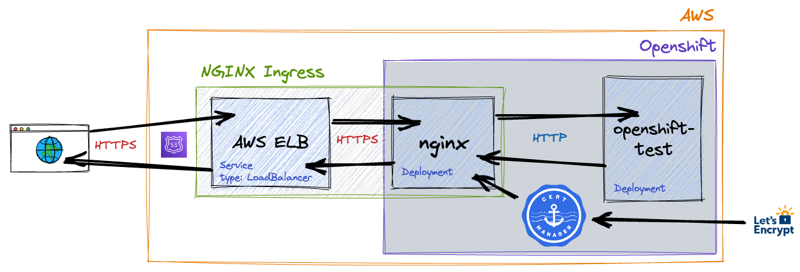

# Openshift with NGINX Ingress Operator and cert-manager

If you're using Openshift on AWS, what are the minimum steps required to secure a public-facing workload using cert-manager and the NGINX Ingress Operator?
This demo attempts to answer that question.

## Introduction
Your goal here is to enforce secure TLS communication between any browser on the internet and a single containerized workload running in Openshift hosted on AWS.
Much like regular Kubernetes clusters hosted on public cloud providers, Openshift supports safely exposing your workloads to the internet via load balancers.

In this scenario, the browser will expect HTTPS (which implies TLS) but the workload itself only supports HTTP.

We can implement a reverse proxy solution by positioning an nginx instance between an internet-facing load balancer (AWS ELB) and the HTTP workload.
The nginx instance can then be loaded with publicly trusted X.509 certificates making it responsible for TLS termination.
To clarify, this means traffic touching the internet is HTTPS whilst traffic touching the workload is plain old HTTP.

The NGINX Ingress Operator is a packaged version of nginx for deployment inside Openshift clusters via the OperatorHub.
Instead of having to edit nginx configuration files by hand, NGINX Ingress supports declarative configuration via Kubernetes Ingress objects.
Those Ingress objects can reference certificates stored as Kubernetes secrets.
On its own, NGINX Ingress is unable to create certificates or renew them before they expire.
That's where cert-manager and Let's Encrypt come in.



## Prerequisites

- The necessary client tools installed
- Access to a running Openshift cluster via `oc`
- Full control of your own domain (or subdomain) surfaced as a **hosted zone** in AWS Route53.

We assume your AWS resources are hosted in the **eu-west-2** region.

These instructions depend upon content from this directory so `git clone` this repo and `cd` as appropriate.

## Enable All OperatorHub sources
Some of the OperatorHub sources may not be available by default meaning that the **NGINX Ingress Operator** may appear to be unavailable.
The following patch will ensure Operators from all the default sources are shown.
```
oc patch OperatorHub cluster --type json \
  -p '[{"op": "add", "path": "/spec/disableAllDefaultSources", "value": false}]'
```

### Web Console accesss
Navigate to `https://console-openshift-console.apps.openshift.<your-domain>/`.
Log in with Username `kubeadmin`.
The password is in `${base}/openshift/auth/kubeadmin-password`.

## Install and configure cert-manager
The following command will install cert-manager via the OperatorHub.
```
oc new-project cert-manager
oc apply -f - <<EOF
apiVersion: operators.coreos.com/v1alpha1
kind: Subscription
metadata:
  name: cert-manager
  namespace: cert-manager
spec:
  channel: stable
  name: cert-manager
  source: community-operators
  sourceNamespace: openshift-marketplace
EOF
```

cert-manager is unable to oversee the creation of any certificates until you have at least one Issuer in place.
The simplest way to create the publicly trusted certificates you require is via Let's Encrypt, so go ahead and set up a cluster-wide issuer for that now.
```
export EMAIL=jbloggs@gmail.com # <-- change this to suit

envsubst <<EOF | oc apply -f -
apiVersion: cert-manager.io/v1
kind: ClusterIssuer
metadata:
  name: letsencrypt
spec:
  acme:
    server: https://acme-v02.api.letsencrypt.org/directory
    email: ${EMAIL}
    privateKeySecretRef:
      name: letsencrypt
    solvers:
      - http01:
          ingress:
            class:  nginx
EOF
```

## Install and configure NGINX Ingress
The following command will install NGINX Ingress Opertaor via the OperatorHub.
```
oc apply -f - <<EOF
apiVersion: operators.coreos.com/v1alpha1
kind: Subscription
metadata:
  name: nginx-ingress-operator
  namespace: nginx-ingress
spec:
  channel: alpha
  name: nginx-ingress-operator
  source: certified-operators
  sourceNamespace: openshift-marketplace
EOF
```

TODO continue from here ...

Next: [Main Menu](/README.md) | [Openshift with ingress-nginx and cert-manager](../02-openshift-ingress-nginx-cert-manager/README.md)
