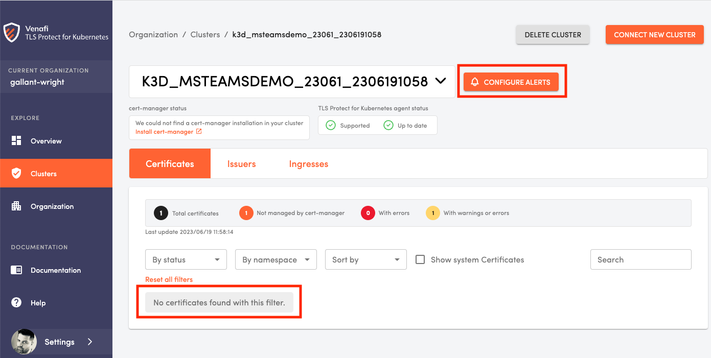
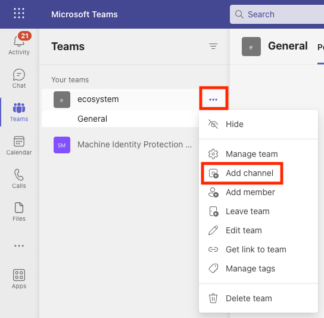
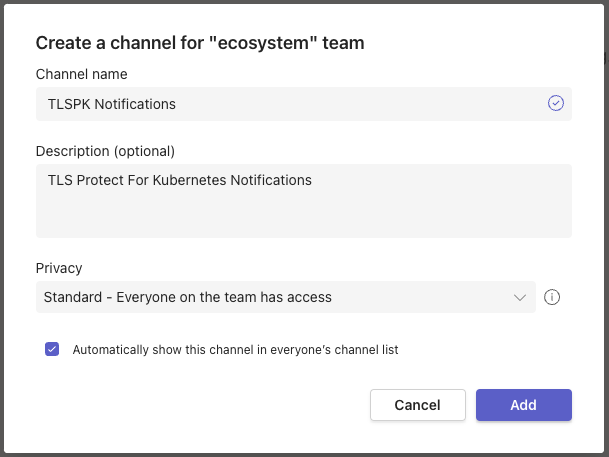
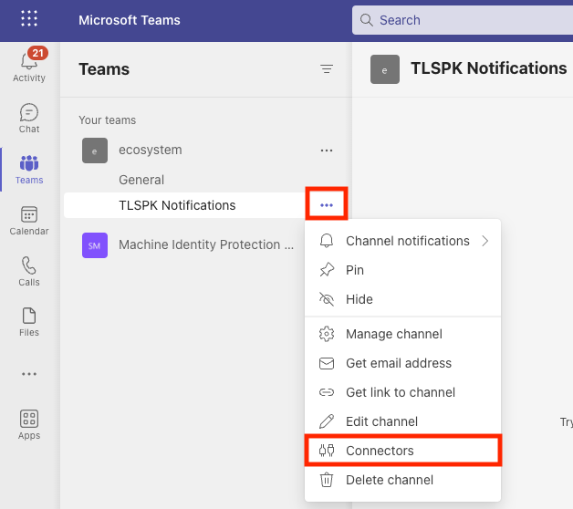
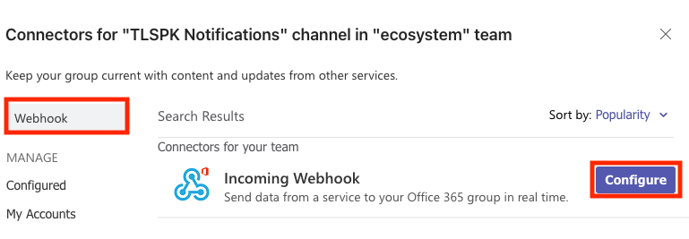
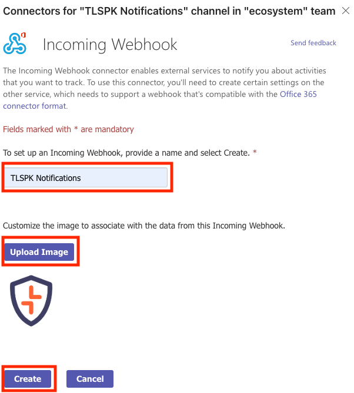
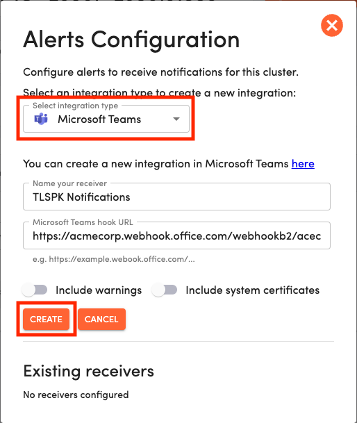
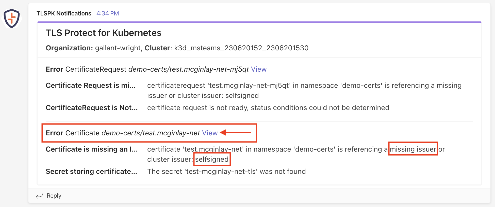

# TLSPK Notifications via Microsoft Teams

This demo attempts to answer a question you may encounter in the enterprise.
If you're using Microsoft Teams alongside Venafi TLS Protect For Kubernetes (often abbreviated to TLSPK) how can you be notified that an observed machine identity requires your attention?

## Introduction
Let's imagine you have 100 Kubernetes clusters, each maintaining 100 machine identities.
In this case, TLSPK is the perfect observability tool for the task.
That said, when everything's running smoothly, the contents of the dashboard are unspectacular so perhaps you don't want it front-and-center at all times.
To efficiently protect against outages, you need a mechanism to draw your attention back to the dashboard when a noteworthy event occurs.

That's what TLSPK Notifications are all about.

## Your goal

In this exercise you will register just one disposable cluster within which you'll create a cert-manager Certificate which TLSPK deems to be unsafe or unusable.
With the appropriate configuration in place, TLSPK will notify you via Microsoft Teams that a noteworthy event requiring your attention has occurred.

## Prerequisites
To complete this task, the following is required
- Admin access to a TLSPK Organization via https://platform.jetstack.io/ with the Microsoft Teams integration feature enabled.
- The ability to create instances of [Channels](https://learn.microsoft.com/en-us/microsoftteams/teams-channels-overview) and [Connectors](https://learn.microsoft.com/en-us/connectors/) in Microsoft Teams
- Root level command-line access to a single disposable x86 Ubuntu (22.04 or later) or Amazon Linux VM.
  This VM will be used to host a lightweight Kubernetes cluster.
  For this we recommend a minimum of 4 CPUs, 4GB RAM, 30GB disk.

## Lightweight cluster creation (tlspk-helper.sh)

**NOTE** the TLSPK helper script is not the only way to build disposable Kubernetes clusters for use with TLSPK, so feel free to complete these steps with whatever tools you choose.

From a Bash session on your **disposable** Linux VM, download the TLSPK helper script
```
cd ${HOME}
curl -fsSLO https://venafi-ecosystem.s3.amazonaws.com/tlspk/v1/tlspk-helper.sh && chmod 700 tlspk-helper.sh
```

Set the TLSPK service account credentials into environment variables.
These can be generated via https://platform.jetstack.io/org/PLACE_ORG_NAME_HERE/manage/service_accounts
```
export TLSPK_SA_USER_ID=<ID>@<ORG>.platform.jetstack.io
export TLSPK_SA_USER_SECRET='<USER_SECRET>' # leave the quotes in place to preserve any control chars present in the user secret
```

You may securely check these variables are in place as follows
```
env | grep '^TLSPK_' | awk -F '=' '{print $1"=<redacted>"}'
```

Install the dependencies required by the helper script.
```
./tlspk-helper.sh install-dependencies --auto-approve
```

Create your lightweight cluster, using a unique and identifiable name
```
nickname=<YOUR_NICKNAME>
cluster_name=${nickname}-$(cut -c-13 <<< $(date +"%y%m%d%H%M%N"))
./tlspk-helper.sh create-local-k8s-cluster --auto-approve --cluster-name ${cluster_name}
```

## Register cluster (TLSPK Agent)

Deploying the TLSPK agent on your cluster will cause that cluster to become registered with TLSPK.

Deploy the TLSPK agent as follows
```
./tlspk-helper.sh deploy-agent --auto-approve
```

After a few seconds, navigate to https://platform.jetstack.io/org/PLACE_ORG_NAME_HERE/certinventory to confirm your new cluster has been successfully registered.
If you click through on the cluster, assuming "Show system Certificates" is deselected, you should see no Certificates.

<p align="center">
  
</p>

You will also observe a "🔔 CONFIGURE ALERTS" button.
Keep this page open as you'll return here shortly.

## Deploy cert-manager (TLSPK Operator)

Deploy cert-manager via the TLSPK Operator as follows
```
./tlspk-helper.sh install-operator --auto-approve
./tlspk-helper.sh deploy-operator-components --auto-approve
```

Confirm that cert-manager was successfully installed
```
kubectl -n jetstack-secure get deploy cert-manager    # <<- this should show "READY 1/1"
```

## Configure Microsoft Teams to receive notifications from TLSPK

**NOTE** the following procedure uses browser-based Office 365 Teams and should be adjusted to suit alternate interfaces.

The three Microsoft Teams components required to complete this task are as follows.

- **Team** - a collaborative workspace where members can communicate and share information in real time. This should be configured to represent the team of individuals interested in preventing outages, e.g. the platform team.
- **Channel** - a dedicated space within a **Team** where members can share information focused on a **specific** topic or project.
When you create a **Team** in Microsoft Teams, it automatically creates a default channel called "General."
- **Connector** - a feature that allows you to integrate external sources of information with your team's **Channels**.
Connectors bring real-time updates and notifications enabling you to stay informed and collaborate effectively without needing to switch between different applications.

Assuming the **Team** you wish to use already exists, open Microsoft Teams, click the associated ellipsis button (...) for your target team and click **"Add Channel"**.

<p align="center">
  
</p>

Enter a meaningful name and description for the new Channel, then ✅ select **"Automatically show this channel in everyone’s channel list"**.
Click **"Add"** to submit these details.

<p align="center">
  
</p>

Locate your Team's new **Channel**, click the associated ellipsis button, then click **"Connectors"**.

<p align="center">
  
</p>

Type the word "Webhook" into the search panel, then click the "Configure" (or "Add") button for the **"Incoming Webhook"** Connector.

<p align="center">
  
</p>

Enter a meaningful name for the Incoming Webhook, upload an identifying image (optional) then click **"Create"** to submit these details.

<p align="center">
  
</p>

Copy the resulting **Webhook URL** before closing all the dialogs.

## Configure TLSPK to transmit notifications to Microsoft Teams

Back in TLSPK, with your cluster selected, click the "🔔 CONFIGURE ALERTS" button introduced earlier.

In the **"Alerts Configuration dialog"**, select Microsoft Teams as the Integration Type, provide your Alert with a name and paste in the **Webhook URL** you copied earlier.
Leave the **"Include warnings"** and **"Include system certifictes"** toggles in the **OFF** position.
Click the **"CREATE"** button before closing all the dialogs to activate your integration.

<p align="center">
  
</p>

## Create an invalid Certificate

There are a variety of Certificate states which TLSPK categorizes as **high-risk** or **error** states.
In order to test the Microsoft Teams integration you set up, you can create a single, invalid cert-manager Certificate that references a **non-existent cert-manager Issuer**, as follows.

```
kubectl create namespace demo-certs

cat << EOF | kubectl -n demo-certs apply -f -
apiVersion: cert-manager.io/v1
kind: Certificate
metadata:
  name: test.mcginlay.net
spec:
  secretName: test-mcginlay-net-tls
  dnsNames:
    - test.mcginlay.net
  usages:
  - server auth
  issuerRef:
    name: self-signed               # <-- ClusterIssuer does not yet exist
    kind: ClusterIssuer
    group: cert-manager.io
EOF
```

## Observe the Microsoft Teams alert

Navigate to the Microsoft Teams Channel you created earlier and, within 1 minute, you will see an alert regarding the Certificate you just created.

<p align="center">
  
</p>

Each alert in Microsoft Teams is accompanied by a **"View"** link, taking the user directly to the high-risk Certificate as reported in TLSPK.
Click the **"View"** link and keep the page open as we complete the next step.

## Resolve the error

Obviously the intention is to address each alert, and this one is no exception.
The Certificate entered an error state in TLSPK because the **"self-signed"** ClusterIssuer did not exist when the Certificate was created.
Let's introduce the missing ClusterIssuer by making an adjustment to the TLSPK Installation manifest.

```
kubectl patch installation jetstack-secure --type merge --patch-file <(cat << EOF
  spec:
    issuers:
      - name: self-signed
        clusterScope: true
        selfSigned: {}
EOF
)
```

When a desired state is not achievable in Kubernetes, it will continue to retry.
With the missing ClusterIssuer now in place the Kubernetes Secrets for the Certificate will be issued and, after about one minute, the error state shown in TLSPK will be rescinded.

<!--
### Create an expired certificate

The practice of using Kubernetes Secrets for Certificate storage pre-dates cert-manager.
cert-manager solves the problem of expired Certificate by ensuring they are renewed and updated in a timely manner.
This means the primary condition we seek to trap in Microsoft Teams by setting an Alert should never exist.

In order to test the Microsoft Teams integration you set up, you can fabricate an **expired** certificate and store that as a Secret.

You can do this as follows from a Bash session on your **disposable** Linux VM.
```
expired_fqdn=expired.mcginlay.net
negative_days=-1

cat <<EOF > ssl.conf
[ req ]
default_bits        = 2048
distinguished_name  = req_distinguished_name
req_extensions      = req_ext

[ req_distinguished_name ]
commonName          = ${expired_fqdn}

[ req_ext ]
keyUsage            = digitalSignature, keyEncipherment
extendedKeyUsage    = serverAuth
subjectAltName      = @alt_names

[ alt_names ]
DNS.1               = ${expired_fqdn}
EOF

openssl genrsa -out key.pem 2048
openssl req -new -key key.pem -out csr.pem -subj "/CN=${expired_fqdn}" -reqexts req_ext -config ssl.conf
openssl x509 -req -in csr.pem -signkey key.pem -out cert.pem -days ${negative_days} -extensions req_ext -extfile ssl.conf
kubectl create namespace demo-certs
kubectl -n demo-certs create secret tls $(tr '.' '-' <<< ${expired_fqdn})-tls --cert=cert.pem --key=key.pem
```
-->

## The case for Venafi TLS Protect For Kubernetes

The example you just saw was simple in the extreme.
One cluster, one Certificate issued one way and only one failure mode.
Imagine scaling this up to dozens of clusters which may not even use cert-manager yet.
Imagine hundreds of undocumented Certificates, built without modern guardrails and sleepwalking towards expiry.

Venafi TLS Protect For Kubernetes provides the capabilities needed to enable effective machine identity management for OpenShift and Kubernetes clusters in the Enterprise.

So look out for more demos like this, revealing how effective machine identity management can accelerate your cloud native development and prevent application outages or security breaches.

This chapter is complete.

Next: [Main Menu](/README.md) | [TLSPK Notifications via PagerDuty](../05-tlspk-notifications-via-pagerduty/README.md)
