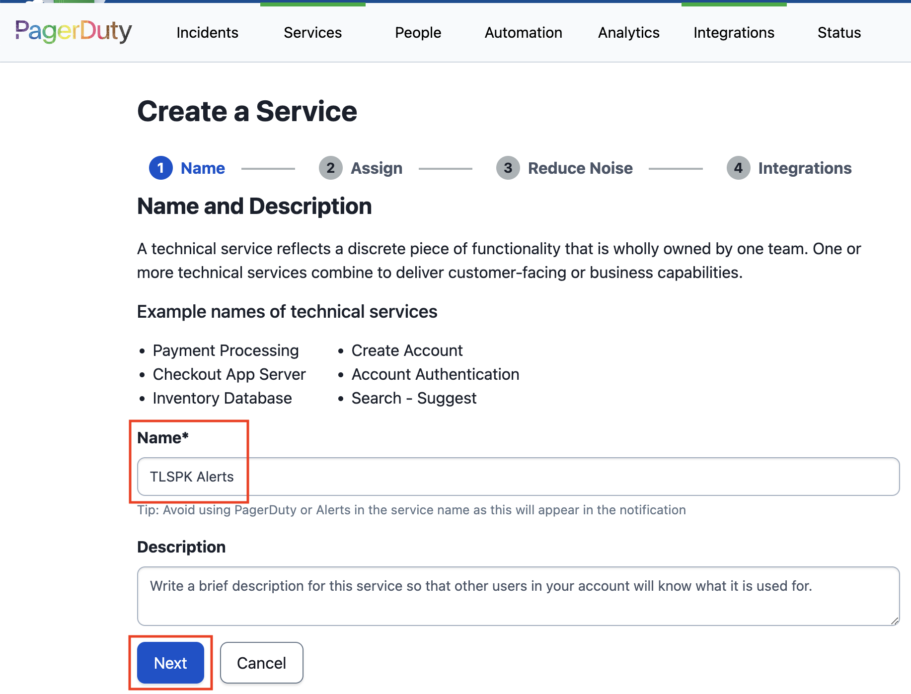
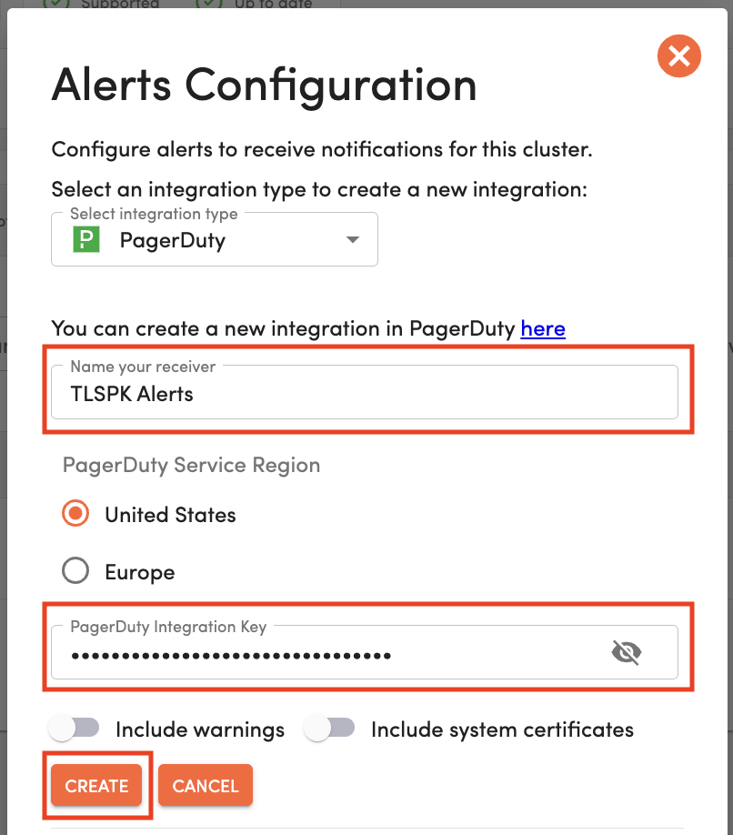

# TLSPK Notifications via PagerDuty

This demo attempts to answer a question you may encounter in the enterprise.
If you're using PagerDuty alongside Venafi TLS Protect For Kubernetes (often abbreviated to TLSPK) how can you be notified that an observed machine identity requires your attention?

If you tried out the recent Microsoft Teams demo you'll recognize many of the following steps

## Introduction
TLSPK is the perfect tool for managing cert-manger instances across a fleet of Kubernetes or OpenShift clusters.
That said, when everything's running smoothly, the contents of the TLSPK dashboard are unspectacular so perhaps you don't want it front-and-center at all times.
To efficiently protect against outages, you need a mechanism to draw your attention back to the dashboard when a noteworthy event occurs.

That's what TLSPK Notifications are all about.

## Your goal

In this exercise you will register just one disposable cluster within which you'll create a cert-manager Certificate which TLSPK deems to be unsafe or unusable.
With the appropriate configuration in place, TLSPK will notify you via PagerDuty that a noteworthy event requiring your attention has occurred.

## Prerequisites
To complete this task, the following is required
- Admin access to a TLSPK Organization via https://platform.jetstack.io/ with the PagerDuty integration feature enabled.
- The ability to create instances of [Services and Integrations](https://support.pagerduty.com/docs/services-and-integrations) in PagerDuty
- Root level command-line access to a single disposable x86 Ubuntu (22.04 or later) or Amazon Linux VM.
  This VM will be used to host a lightweight Kubernetes cluster.
  For this we recommend a minimum of 4 CPUs, 4GB RAM, 30GB disk.

## Lightweight cluster creation (tlspk-helper.sh)

**NOTE** the TLSPK helper script is not the only way to build disposable Kubernetes clusters for use with TLSPK, so feel free to complete these steps with whatever tools you choose.

From a Bash session on your **disposable** Linux VM, download the TLSPK helper script
```
cd ${HOME}
curl -fsSLO https://venafi-ecosystem.s3.amazonaws.com/tlspk/v1/tlspk-helper.sh && chmod 700 tlspk-helper.sh
```

Set the TLSPK service account credentials into environment variables.
These can be generated via https://platform.jetstack.io/org/PLACE_ORG_NAME_HERE/manage/service_accounts
```
export TLSPK_SA_USER_ID=<ID>@<ORG>.platform.jetstack.io
export TLSPK_SA_USER_SECRET='<USER_SECRET>' # leave the quotes in place to preserve any control chars present in the user secret
```

You may securely check these variables are in place as follows
```
env | grep '^TLSPK_' | awk -F '=' '{print $1"=<redacted>"}'
```

Install the dependencies required by the helper script.
```
./tlspk-helper.sh install-dependencies --auto-approve
```

Create your lightweight cluster, using a unique and identifiable name
```
nickname=<YOUR_NICKNAME>
cluster_name=${nickname}-$(cut -c-13 <<< $(date +"%y%m%d%H%M%N"))
./tlspk-helper.sh create-local-k8s-cluster --auto-approve --cluster-name ${cluster_name}
```

## Register cluster (TLSPK Agent)

Deploying the TLSPK agent on your cluster will cause that cluster to become registered with TLSPK.

Deploy the TLSPK agent as follows
```
./tlspk-helper.sh deploy-agent --auto-approve
```

After a few seconds, navigate to https://platform.jetstack.io/org/PLACE_ORG_NAME_HERE/certinventory to confirm your new cluster has been successfully registered.
If you click through on the cluster, assuming "Show system Certificates" is deselected, you should see no Certificates.

<p align="center">
  
</p>

You will also observe a "🔔 CONFIGURE ALERTS" button.
Keep this page open as you'll return here shortly.

## Deploy cert-manager (TLSPK Operator)

Deploy cert-manager via the TLSPK Operator as follows
```
./tlspk-helper.sh install-operator --auto-approve
./tlspk-helper.sh deploy-operator-components --auto-approve
```

Confirm that cert-manager was successfully installed
```
kubectl -n jetstack-secure get deploy cert-manager    # <<- this should show "READY 1/1"
```

## Configure PagerDuty to receive notifications from TLSPK

The PagerDuty components required to complete this task are as follows.

- **Service** - reflects a discrete piece of functionality that is wholly owned by one team. One or more technical services combine to deliver customer-facing or business capabilities.
- **Integration** - a feature that allows you to integrate external sources of information with your team's **Services**.

**NOTE** PagerDuty expects a work email to be provided during its sign-up procedure.
The domain of your email is used to build a PagerDuty subdomain (e.g. `venafi.pagerduty.com`) which determines the workspace you get admitted to.
To provide isolation whilst you experiment with PagerDuty you may prefer to set up an email address against a personal domain.

From your personalized PagerDuty home page, select the the **"Services"** tab and click **"+ New Service"**.

<p align="center">
  
</p>

Provide a meaningful name for your new Service, and click **"Next"**.

<p align="center">
  
</p>

When requested to assign an Escalation Policy, select the existing policy name **"Default"**, and click **"Next"**.

<p align="center">
  
</p>

On the **"Reduce Noise"** page, **"Turn Off Alert Grouping"**, and click **"Next"**.

<p align="center">
  
</p>

Finally, on the **"Integrations"** page, select the tile labeled **"Events API V2"**, and click **"Create Service"**.

<p align="center">
  
</p>

The **"Summary"** page describes the capabilities of your chosen Integration and presents you with an **"Integration Key"**.

Once your Integration is is place, you will be taken to the **"Service Integrations"** screen for your new Service.
On the right hand side of the screen, locate the **"Alert Events Integration URL"** for the **"Events API V2"** Integration.

**Copy these values** for use later in these instructions.

<p align="center">
  
</p>

## Configure TLSPK to transmit notifications to PagerDuty

Back in TLSPK, with your cluster selected, click the "🔔 CONFIGURE ALERTS" button introduced earlier.

In the **"Alerts Configuration dialog"**, select PagerDuty as the Integration Type, provide your Alert with a meaningful name and paste in the **Integration Key** you copied earlier.
Leave the **"Include warnings"** and **"Include system certifictes"** toggles in the **OFF** position.
Click the **"CREATE"** button before closing all the dialogs to activate your integration.

<p align="center">
  
</p>

## Create an invalid Certificate

There are a variety of Certificate states which TLSPK categorizes as **high-risk** or **error** states.
In order to test the Microsoft Teams integration you set up, you can create a single, invalid cert-manager Certificate that references a **non-existent cert-manager Issuer**, as follows.

```
kubectl create namespace demo-certs

cat << EOF | kubectl -n demo-certs apply -f -
apiVersion: cert-manager.io/v1
kind: Certificate
metadata:
  name: test.mcginlay.net
spec:
  secretName: test-mcginlay-net-tls
  dnsNames:
    - test.mcginlay.net
  usages:
  - server auth
  issuerRef:
    name: self-signed               # <-- ClusterIssuer does not yet exist
    kind: ClusterIssuer
    group: cert-manager.io
EOF
```

## Observe the PagerDuty alert

Navigate to your PagerDuty home page (e.g. `venafi.pagerduty.com`).
This dashboard page will be titled **"Incidents on All Teams"**.
Within 1 minute, assuming no other activity occurs, you will see an alert regarding the **Certificate** you just created.

**NOTE** please disregard any Alerts related to **Certificate Requests**.

For the Certificate alert, click the link that reads **"SHOW DETAILS (1 triggered alert)"**

<p align="center">
  
</p>

Each TLSPK alert in PagerDuty is accompanied by a **"View in TLS Protect For Kubernetes"** link, taking the user directly to the high-risk Certificate as reported in TLSPK.
Click the link and keep the page open as we complete the next step.

## Resolve the error

Obviously the intention is to address each alert, and this one is no exception.
The Certificate entered an error state in TLSPK because the **"self-signed"** ClusterIssuer did not exist when the Certificate was created.
Let's introduce the missing ClusterIssuer by making an adjustment to the TLSPK Installation manifest.

```
kubectl patch installation jetstack-secure --type merge --patch-file <(cat << EOF
  spec:
    issuers:
      - name: self-signed
        clusterScope: true
        selfSigned: {}
EOF
)
```

When a desired state is not achievable in Kubernetes, it will continue to retry.
With the missing ClusterIssuer now in place the Kubernetes Secrets for the Certificate will be issued and, after about one minute, the error state shown in TLSPK will be rescinded.

## The case for Venafi TLS Protect For Kubernetes

The example you just saw was simple in the extreme.
One cluster, one Certificate issued one way and only one failure mode.
Imagine scaling this up to dozens of clusters which may not even use cert-manager yet.
Imagine hundreds of undocumented Certificates, built without modern guardrails and sleepwalking towards expiry.

Venafi TLS Protect For Kubernetes provides the capabilities needed to enable effective machine identity management for OpenShift and Kubernetes clusters in the Enterprise.

So look out for more demos like this, revealing how effective machine identity management can accelerate your cloud native development and prevent application outages or security breaches.

This chapter is complete.

Next: [Main Menu](/README.md) | [Machine Identity Management via AWS CloudFormation](../06-machine-identity-management-via-aws-cloudformation/README.md)

