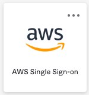
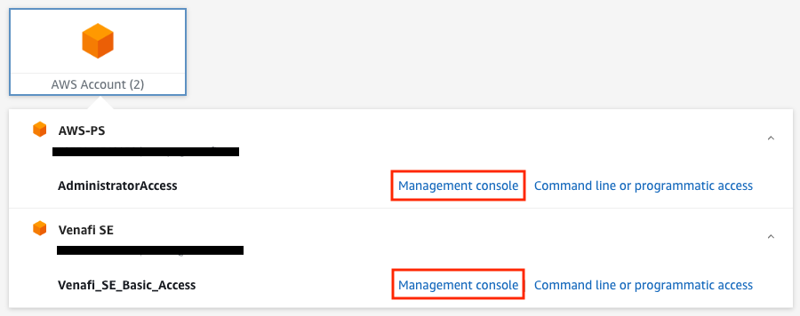

# 01. Requirements, Terminology and Disclaimers

## Requirements

To successfully complete this workshop you will need:

- Access to an [AWS Console](https://aws.amazon.com/console/) - choose ONE of the following options:
  - **Option 1:** Access to the "AWS Single Sign-on" (SSO) tile via https://venafi.okta.com/ with a minimum of "Basic" access to one of the following AWS Accounts via SSO:
    - "venafi-se" (aka "Venafi SE")
    - "venafi-ps" (aka "AWS-PS")

  

  

  - **Option 2:** Access to the Jetstack AWS Account with a minimum of "Basic" access
    - https://jetstack-dev.signin.aws.amazon.com/console
  - **Option 3:** Any other AWS Account including personal Accounts
- To use the **"us-east-1"** [AWS region](https://aws.amazon.com/about-aws/global-infrastructure/regions_az/), simply because it's tried and tested there
- At least one VSatellite instance supporting the "Keypair generation service" should be shown as active at https://ui.venafi.cloud/vsatellites.
- Access, via either your own domain or the company shared one, to TLSPC at https://ui.venafi.cloud/.
  You will need to ensure your user has the permissions necessary to create Applications and Certificate Issuing Templates, so navigate to the following URLs and confirm you can see the "New" button in the upper-left portion of **both** pages:
  - https://ui.venafi.cloud/applications
  - https://ui.venafi.cloud/certificate-issuance/issuing-templates

  

## Terminology

The following table covers a few terms which you'll see in this workshop and the minimum you need to know about them.

| Term  | Description |
| - | - |
| [ARN](https://docs.aws.amazon.com/IAM/latest/UserGuide/reference-arns.html) | An Amazon Resource Name (ARN) is a system-generated identifier which AWS assigns to each and every AWS resource. These identifiers are **universally unique** within the AWS cloud. |
| [Template](https://docs.aws.amazon.com/AWSCloudFormation/latest/UserGuide/template-guide.html) | The YAML or JSON file passed to CloudFormation which describes a collection of desired resources and their inter-dependencies. These resources are typically restricted to AWS, but not today! |
| [Stack](https://docs.aws.amazon.com/AWSCloudFormation/latest/UserGuide/stacks.html) | When you provide a **name** and **parameters** to a Template you can then ask CloudFormation to "run" it for you. CloudFormation will transform your collection of desired resources into live resources with ARNs. A transformed collection of resources is referred to as a Stack. Stack names in AWS must be unique on a per Account+Region basis. |
| [EC2](https://aws.amazon.com/ec2) | Amazon Elastic Compute Cloud (EC2) is the original AWS cloud computing service. It produces Virtual Machines which are billable regardless of their use. (You will not be using EC2) |
| [S3](https://aws.amazon.com/s3) | Amazon Simple Storage Service (S3) is a scalable cloud storage service providing unlimited and inexpensive storage and retrieval of data, potentially from anywhere on the web. |
| [Lambda](https://aws.amazon.com/lambda) | A serverless compute service provided by AWS that allows you to run your code without having to provision or manage EC2 instances. Unlike EC2, Lambda only charges you for the time that your code is running. |
| [Function](https://docs.aws.amazon.com/lambda/latest/dg/gettingstarted-concepts.html#gettingstarted-concepts-function) | A piece of code uploaded to AWS Lambda which comes into existence and executes in response to specific events. Lambda Function instances are short-lived and stateless so they often use S3 for their persistence requirements. Lambda Functions are typically, but not exclusively, written in Python or NodeJS and can be invoked from Custom Resources. |

## Disclaimers

The Ecosystem team would like to clarify that this solution is by no means the finished article.
Coverage of the TLSPC API does not extend too far at this point and features you might expect to see will be missing.
The primary motivation for putting this workshop together was to establish a proof of concept; to have you experience what's possible first-hand and get you thinking about what types of third-party integrations are valuable.

Maybe you think the Ecosystem team should focus their automation and IaC integration efforts elsewhere.
Or maybe you think we missed the point completely.
Either way, we'd love to know.
If customers are telling you they need something like this, but different in some way, let's work together to provide them with the tools they need to be "FastSecure".

Next: [Main Menu](../README.md) | [02. One-Time AWS Account Setup](../02-one-time-aws-account-setup/README.md)