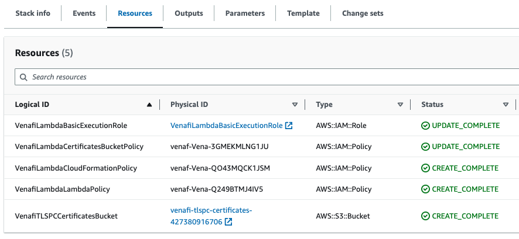

# 02. One-Time AWS Account Setup

## What's this all about?

Security teams need to strike a balance between granting enough privilege for staff to do the job, whilst staying secure.
Privilege escalation risks in AWS are contained by limiting what you're allowed to do, particularly with the [Identity and Access Management](https://aws.amazon.com/iam) (IAM) service.
Such limits can impact the standard workflow used when creating and deploying Lambda functions.
We can address this in each AWS Account by pre-configuring an [IAM Role](https://docs.aws.amazon.com/IAM/latest/UserGuide/id_roles.html) for Lambda to use, but an individual blessed with **administrative/elevated rights** will need to apply the fix.

Assuming you have the **administrative/elevated rights** required in your AWS Account, read on.

If you're not sure, please consult your support team to complete the **One-Time AWS Account Setup**.

## Creating your Stack

The following steps will enable Lambda Functions in the exercises to be successfully created.

1. Navigate to https://us-east-1.console.aws.amazon.com/cloudformation/home
1. Click on "Create stack", then click "With new resources (standard)"
1. On the "Create stack" page, under "Specify template", set **"Amazon S3 URL"** to
   ```
   https://venafi-ecosystem.s3.amazonaws.com/tlspc/templates/venafi-one-time-setup.yaml
   ```
   then click "Next"
1. On the "Specify stack details" page:
   - Set **"Stack name"** to
   ```
   venafi-one-time-setup
   ```
   - Click "Next"
1. On the "Configure stack options" page, under "Stack failure options", select **"Preserve successfully provisioned resources"**
   then click "Next"
1. Scroll to the foot of the "Review" page, check ✅ the "Capabilities" checkbox and finally click "Submit"

<p align="center">
  
</p>

After ~30 secs, the Stack will reach a "Status" of "CREATE_COMPLETE".
You will now be able to continue with the exercises in this workshop.

NOTE: You ran the Template in the "us-east-1" region.
Please keep to this arrangement.

NOTE: To get the most benefit from these exercises, we recommend the use of [Versioned S3 Buckets](https://docs.aws.amazon.com/AmazonS3/latest/userguide/Versioning.html).
If the Stacks you create in the exercise use the default Bucket created by this One-Time Stack, then Versioning is enabled for you.

## Resources Deployed

The resources deployed relate mainly to IAM permissions.
There is also an S3 bucket which is used to store state and generated artifacts.

<p align="center">
  
</p>

## What you learned

- [Security is "Job Zero"](https://aws.amazon.com/blogs/enterprise-strategy/security-at-aws/)
- Some complexity is caused by AWS users not all having the same privileges
- CloudFormation can help you contain complexity

Next: [Main Menu](../README.md) | [03. TLSPC Policy Automation](../03-tlspc-policy-automation/README.md)
