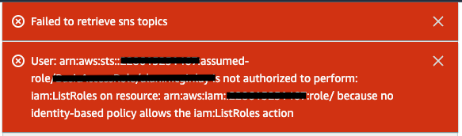
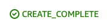
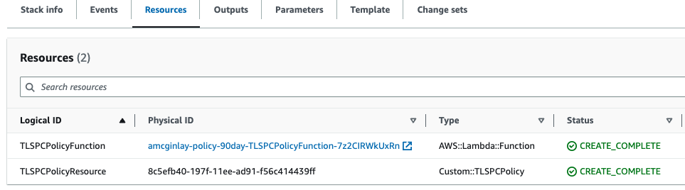
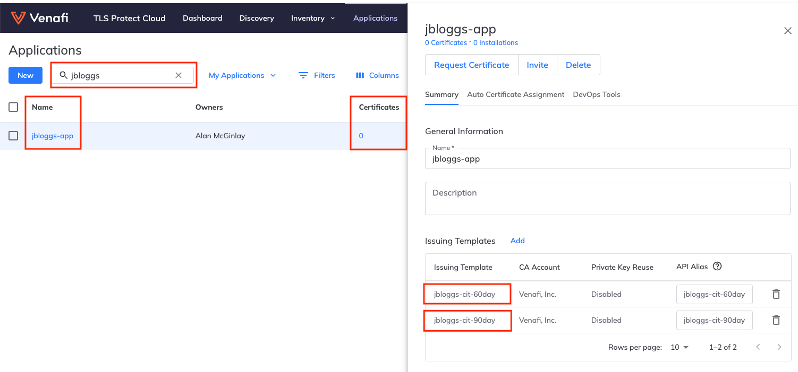
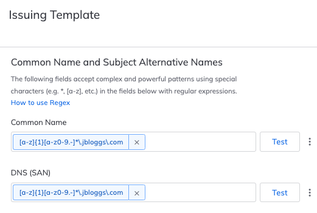
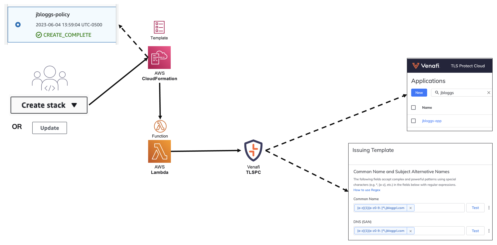

# 03. TLSPC Policy Automation

## What you will learn

In this section you will use CloudFormation (sometimes abbreviated to CFN, or just CF) to deploy a Custom Resource representing a Policy.
In this context a Policy is represented by a pair of TLSPC resources, as follows.

- A **TLSPC Application** - A means to categorize policy-enforced collections of Certificate Requests and their Certificates.
  Applications in TLSPC are shown at https://ui.venafi.cloud/applications.
- A **TLSPC Certificate Issuing Template** (CIT) - Used to configure security policies that are enforced whenever new Certificates are requested via TLSPC.
  To enable a TLSPC CIT for use in Certificate policy enforcement it must first be associated with a TLSPC Application.
  CITs in TLSPC are shown at https://ui.venafi.cloud/certificate-issuance/issuing-templates.

The choice to pair these resources under the term "Policy" was inspired by the implementation of VCert's [setpolicy](https://github.com/Venafi/vcert/blob/master/README-CLI-CLOUD.md#parameters-for-applying-certificate-policy) action, which condenses the functionality of the underlying resources down to their essential features.

## A note on Defaults and "soft" errors

Unless otherwise stated, all AWS Console settings should be left in their **DEFAULT** state.

<p align="center">
  
</p>

Any red banners which appear in the AWS Console during these steps (shown above) are typically caused by policy restrictions in the AWS Account.
It is possible these are "soft" errors, in which case these will not prohibit you from clicking the "Submit" button and can be safely **IGNORED**.

## Tenants

TLSPC expects a work related email to be provided during its standard sign-up procedure (i.e. **not** one used for personal communication).
If the domain of your email was hitherto unseen, TLSPC will assign you a pristine tenant/workspace.
In all other cases the existing tenant/workspace for the domain, with its current configuration and data, is shared between users in the same domain.
To provide isolation whilst you experiment with TLSPC you may prefer to set up an email address against a personal domain.

Pristine tenants include a single pre-defined Certificate Authority (CA), of type **"BUILTIN"**, named **"Built-In CA"**.
For convenience, pristine tenants also include a corresponding CIT named **"Default"** with a wide-open policy.

## Certificate Authority Products (DigiCert)

Despite it not always being evident from the TLSPC UI, the CITs you create require a CA Product to be specified.
At the API/SDK level, CA Products take the form of a triplet in the form `<CA_PROVIDER>\<CA_TLSPC_NAME>\<CA_PRODUCT_OPTION>`.
In the case of the **"Built-In CA"**, which has a single Product, that triplet is always `BUILTIN\Built-In CA\Default Product`.

This is fine for communication between **private** workloads but you'll need an alternate CA, such as [**DigiCert**](www.digicert.com), before TLSPC can deliver any publicly trusted certificates for you.

The following instructions assume you have pre-configured a `DIGICERT` CA instance, named **"Digicert Test Account"**.

**NOTE** if the assumption above is not valid in your environment, we recommend you fall back to using **"Built-In CA"**.

Unlike the `BUILTIN` CA, the `DIGICERT` CA provides a variety of CA Products which are summarized [here](https://www.digicert.com/secure/requests/products/).
The DigiCert Product supported/tested for use with this demo is **"Cloud"**, known internally by TLSPC as `ssl_cloud_wildcard`.

This is how we arrive at the CA Products such as `DIGICERT\Digicert Test Account\ssl_cloud_wildcard`

All other CAs and their products should be considered out of scope for now.

## Creating your first Policy Stack (90 days)

The following steps will model your Policy requirements in a Cloudformation Stack and realize these inside TLSPC.
The resulting Application and CIT in TLSPC will be used later to create certificates.

1. Navigate to https://us-east-1.console.aws.amazon.com/cloudformation/home
1. Click on "Create stack", then click "With new resources (standard)"
1. On the "Create stack" page, under "Specify template", set **"Amazon S3 URL"** to
   ```
   https://venafi-ecosystem.s3.amazonaws.com/tlspc/templates/tlspc-policy.yaml
   ```
   then click "Next"
1. On the "Specify stack details" page:
   - Set **"Stack name"** to something uniquely identifiable for **yourself**, plus the letters "-policy".
     Stack name can include letters (A-Z and a-z), numbers (0-9), and dashes (-).
     For example, John Lennon could use
     ```
     johnlennon-policy-90day
     ```
   - A **"Zone"** is a logical organizational unit used for managing digital certificates.
     The typical form of a Zone is **AppName\CertificateIssuingTemplateAlias**.
     As you can see this pairing aligns with the "Policy" definition described above.
     Set this value to match your personal details.
     For example, adopting the `-app` suffix to represent the Appliction and the `-cit-90day` suffix to represent the CIT, John Lennon could use
     ```
     johnlennon-app\johnlennon-cit-90day
     ```
   - You will recall that **"CertificateAuthorityProduct"** is a triplet taking the form `<CA_PROVIDER>\<CA_TLSPC_NAME>\<CA_PRODUCT_OPTION>`. 
   Choose one of the following options.
     - **Option 1** (preferred): Use the **DigiCert** CA, **adjusting** the `<CA_TLSPC_NAME>` placeholder to suit your environment.
       ```
       DIGICERT\<CA_TLSPC_NAME>\ssl_cloud_wildcard
       ```
     - **Option 2**: Use the **Built-In** CA.
       ```
       BUILTIN\Built-In CA\Default Product
       ```
   - **"MaxValidDays"** is the maximum number of days for which any created/renewed certificate is considered valid.
     Leave this setting unchanged, at
     ```
     90
     ```
   - **"Domains"** is a list of domain names considered valid in the context of Certificates governed by this Policy.
     As you will see later, the template supports multiple domain names when provided as a comma-separated list.
     For now, to support a single domain name, John Lennon could use
     ```
     johnlennon.com
     ```
     **IMPORTANT NOTE** before building publicly trusted certificates (next chapter) your CA provider requires proof of domain ownership.
     Using the `DIGICERT\<CA_TLSPC_NAME>\ssl_cloud_wildcard` product as an example, failure to provide proof of ownership to **DigiCert** upfront, will ultimately cause the creation of `johnlennon.com` certificates to fail.
     This process is known as [Domain Control Validation](https://docs.digicert.com/en/certcentral/manage-certificates/dv-certificate-enrollment/domain-control-validation--dcv--methods.html).
   - Set **"TLSPCAPIKey"** to whatever API Key value is provided to you at https://ui.venafi.cloud/platform-settings/user-preferences?key=api-keys
   - Click "Next"
1. **Double-check** for any mistakes in the above before moving on.
1. On the "Configure stack options" page, under "Stack failure options", select **"Preserve successfully provisioned resources"**
1. Scroll to the foot of the "Review" page and finally click "Submit"

<p align="center">
  
</p>

After ~30 secs, the Stack will reach a "Status" of "CREATE_COMPLETE".

## Resources Deployed

There are two resources deployed by each Policy Stack.
They are the Lambda function, which contains the TLSPC integration logic, and the Custom Resource which integrates with CloudFormation to decide when the Create/Update/Delete logic should be invoked.

<p align="center">
  
</p>

<!-- ## Before you ask, "Yeah, but what about X?" ...

In its current form these templates miss off lots of **policy properties**, such as CSR parameters, Key Algorithms and Extended Key Usage.
This project is currently in its early stages but we have lots of "Future State" ideas that you can expect to see soon.
If you have any of your own, please reach out so we can evaluate these too. -->

## Creating your second Policy Stack (60 days)

This time you will create a policy with a **"MaxValidDays"** of 60.

For convenience, here's that all-important template URL once more
```
https://venafi-ecosystem.s3.amazonaws.com/tlspc/templates/tlspc-policy.yaml
```

**Repeat** the previous section word-for-word, except you need to change **every** occurrence of the characters "90" to **"60"**.

For example, remembering that you're probably not named John Lennon 🙂, he would make the following adjustments to the previous instructions.

| Setting | NOW USING | (setting in previous stack) |
| - | - | - |
| **Stack name** | **johnlennon-policy-60day** | johnlennon-policy-90day |
| **Zone** | **johnlennon-app\johnlennon-cit-60day** | johnlennon-app\johnlennon-cit-90day |
| **MaxValidDays** | **60** | 90 |

"Submit" your personalized "60day" Policy as you did previously.

**NOTE**: the VCert logic takes the **"Zone"** and splits it into a pair of prospective resources, an **Application** and a **CIT**.
As you Create your second Policy Stack, it recognizes that the **Application** resource already exists and re-uses it.
On the other hand, the 60 day **CIT** resource does not exist so this is created as expected.
As you will see next, this results in your **single** Application now having both CITs attached to it.

## Reviewing your results

At this point your newly created TLSPC resources (1 Application and 2 CITs) will become visible at the following URLs.

- **TLSPC Certificate Issuing Template** - https://ui.venafi.cloud/certificate-issuance/issuing-templates
- **TLSPC Application** - https://ui.venafi.cloud/applications

Take a moment to find or search for your Application.
Click on the Application name which shows as a blue hyperlink and confirm the following:

- No Certificates exist.
- Both CITs are attached

<p align="center">
  
</p>

NOTE: [Wildcard DNS records](https://en.wikipedia.org/wiki/Wildcard_DNS_record) are supported by the TLSPC Policy template.
This means that when we specify the domain `example.com`, the CIT will support validation of Certificates for both `www.example.com` and `app.example.com`.
That is not to say that wildcard certificate creation is guaranteed to be successful as your choice of CA Product may also influence the outcome.
Whilst you will take advantage of this configuration in the next exercise it should be noted that this may not be suitable for modern production environments.

<p align="center">
  
</p>

## Updating a Policy Stack

The following steps will update one of your CITs in TLSPC.
In doing so, you will familiarize yourself with the process for updating Stacks in CloudFormation.

1. Navigate to https://us-east-1.console.aws.amazon.com/cloudformation/home
1. **Carefully** search for your own **90 day** Policy Stack using the personalized Stack name you provided earlier.
1. The Stack name is displayed as a blue hyperlink.
   Click this link now.
1. Take a moment to browse over tabs which are on display.
   Here are some observations regarding these tabs.
   - **Stack info** - This tab includes the system generated Stack ID. This is an example of an [ARN](https://docs.aws.amazon.com/IAM/latest/UserGuide/reference-arns.html).
   - **Events** - Details the steps CloudFormation has taken to (one hopes) successfully translate your parameterized Template into a Stack.
   The Events tab is usually your first port of call for diagnostics when investigating CloudFormation failures.
   - **Resources** - A list of the resources (Native AWS and Custom) which CloudFormation created for you. You will observe that your Stack has one native resource (Lambda Function) and one custom resource (TLSPCPolicy).
   In the column named Physical ID you will find a handy blue hyperlink to the Lambda Function.
   From the Lambda Function page, you can then navigate to its [CloudWatch](https://aws.amazon.com/cloudwatch) logs via the "Monitor" tab to gain further diagnostics when investigating failures.
   The Physical ID for the TLSPCPolicy features a collection of letters and numbers.
   **Ask yourself, what do you think this represents?**
   - **Outputs** - Outputs are selected informative results of successful runs. For example, if your stack creates a database entry CloudFormation could deposit a unique identifier here.
   - **Parameters** - A transcript of the Parameters used when the Stack was Created or Updated.
   - **Template** - A transcript of the Template used when the Stack was Created or Updated.
   - **Change sets** - This feature is beyond scope for today.
1. In the upper-right portion of the screen you will see 4 buttons.
   Locate the "Update" button and click it.
1. On the "Update stack" page, click "Next".
1. On the "Specify stack details" page:
   - We stated previously that the **"Domains"** parameter is a list but we only provided a single element when the Stack was Created.
     For Example, if you're John Lennon (and you're not! 🙂), you could now use comma-separated text to specify additional domains, such as
     ```
     johnlennon.com,example.com
     ```
     Go ahead and make a similar change.
   - Click "Next"
1. Scroll to the foot of the "Configure stack options" page, then click "Next"
1. Scroll to the foot of the "Review" page and finally click "Submit"

<p align="center">
  
</p>

After ~30 secs, the stack will reach a "Status" of "UPDATE_COMPLETE".

Now, when you locate your CIT at https://ui.venafi.cloud/certificate-issuance/issuing-templates, it will display its new updated domain configuration.

## What you learned

- In the context of TLSPC:
  - A "Policy" can be viewed as the combination of a single **CIT** linked to a single **Application**
  - The terms "Policy" and "Zone" are somewhat interchangeable
- The functionality of VCert is not confined to a CLI
- Resources in CloudFormation can be both AWS Native and Custom
- Custom Resources are CloudFormation's primary extensibility tool
- Templates are used to Create, Update and Delete Stacks
- Templates are generalized via Parameters, which aid re-use

## Recap Diagram

<p align="center">
  
</p>

Next: [Main Menu](../README.md) | [04. TLSPC Certificate Automation](../04-tlspc-certificate-automation/README.md)
