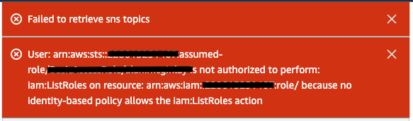

# 04. TLSPC Certificate Automation

## What you will learn

In this section you will use CloudFormation to deploy a Custom Resource representing a [Certificate Request](https://en.wikipedia.org/wiki/Certificate_signing_request) (CR) in TLSPC.
For the purpose of tracking and policy enforcement, each CR is associated to a Zone (defined in the previous exercise).
Upon successful issuance, each CR will be paired with exactly one Certificate in TLSPC.
All Key Material (i.e. Certificates and Private Keys) generated via TLSPC will be pulled into your AWS Account and persisted to an S3 Bucket.

Timely Certificate renewal prevents outages.
In TLSPC, [Certificate renewals](https://docs.venafi.cloud/vaas/certificates/renewing-a-certificate/) are typically achieved by cloning and resubmitting the most recent successful CR.
Over time, this sequence of CRs and Certificates builds to create a useful audit trail.
In this exercise, you will employ the use of the [Amazon EventBridge Scheduler](https://docs.aws.amazon.com/eventbridge/latest/userguide/scheduler.html) to automate the renewal process, ensuring that Certificate renewals always take place before the current latest Certificate expires.

In other words, your end goal is to avoid seeing this dialog again ...

<p align="center">
  
</p>

... whilst putting an end to at-risk Certificates appearing in the [TLSPC Dashboard](https://ui.venafi.cloud/certificate-issuance/dashboard)

<p align="center">
  
</p>

## A note on Defaults and "soft" errors

Unless otherwise stated, all AWS Console settings should be left in their **DEFAULT** state.

<p align="center">
  
</p>

Any red banners which appear in the AWS Console during these steps (shown above) are typically caused by policy restrictions in the AWS Account.
It is possible these are "soft" errors, in which case these will not prohibit you from clicking the "Submit" button and can be safely **IGNORED**.

## Creating your Certificate Stack

The following steps will model your Certificate Request requirements in a Cloudformation Stack, realize these inside TLSPC, persist the resultant key material and prevent future outages by ensuring timely renewals.

1. Navigate to https://us-east-1.console.aws.amazon.com/cloudformation/home
1. Click on "Create stack", then click "With new resources (standard)"
1. On the "Create stack" page, under "Specify template", set **"Amazon S3 URL"** to
   ```
   https://venafi-ecosystem.s3.amazonaws.com/tlspc/templates/tlspc-certificate.yaml
   ```
   then click "Next"
1. On the "Specify stack details" page:
   - Set **"Stack name"** to something uniquely identifiable for **yourself**, plus the letters "-cert".
     Stack name can include letters (A-Z and a-z), numbers (0-9), and dashes (-).
     For Example, John Lennon could use
     ```
     johnlennon-cert
     ```
   - A **"Zone"** is a logical organizational unit used for managing digital certificates.
     The typical form of a Zone is **AppName\IssuingTemplateAlias**.
     You already have personalized "90 day" and "60 day" Zones from the previous exercise.
     Carefully set this value to match your personalized "90 day" Zone.
     For example, John Lennon could use
     ```
     johnlennon-app\johnlennon-cit-90day
     ```
   - You will recall that Wildcards are currently supported by the domains listed in in your CITs.
     **Carefully** set **"CommonName"** on the TLSPC Certificate to be a subdomain thereof.
     For Example, John Lennon set his "90 day" domain to `johnlennon.com` so he could use
     ```
     www.johnlennon.com
     ```
   - **"ValidityHours"** is the number of hours your certificates should be considered valid.
     A Zero "0" here indicates you are willing to inherit this setting from the Zone's Issuing Template.
     Leave this setting unchanged, at
     ```
     0
     ```
   - **"RenewalHours"** is the interval in hours between certificate renewal requests.
     To protect from outages caused by certificate expiry, this value should be a number lower than the Validity period.
     The Validity period on this cert is likely to be the equivalent of 90 days, so set this value to 60 days, which **converted to hours** is
     ```
     1440
     ```
   - Set **"TLSPCAPIKey"** to whatever API Key value is provided to you at https://ui.venafi.cloud/platform-settings/user-preferences?key=api-keys
   - Use **"PrivateKeyPassphrase"** to specify a password for encrypting the private key.
     Set this to something extremely difficult 😉 to guess, such as
     ```
     SuperSecret123!
     ```
   - **"TargetS3Bucket"** is the name of a Versioned S3 Bucket where your TLSPC Certificates will be deposited.
     The Venafi One-Time Setup Template ensures that the default Bucket for your Account, named `venafi-tlspc-certificates-${AWS::AccountId}`, is available.
     For the purpose of this workshop, we advise that you leave this parameter **BLANK**.
     ```
     ```
   - **"UpdateTrigger"** is for internal use and only serves a non-functional purpose.
     We advise that you leave this parameter **BLANK**.
     ```
     ```
   - Click "Next"
1. On the "Configure stack options" page, under "Stack failure options", select **"Preserve successfully provisioned resources"**
1. Scroll to the foot of the "Review" page and finally click "Submit"

<p align="center">
  
</p>

After ~30 secs, the stack will reach a "Status" of "CREATE_COMPLETE".

## Resources Deployed

There are four resources deployed by each Certificate Stack.
They are as follows.
- The Lambda function which contains the TLSPC integration logic
- The Custom Resource which integrates with CloudFormation to decide when the Create/Update/Delete TLSPC logic should be invoked
- The Lambda function which triggers the [UpdateStack](https://docs.aws.amazon.com/AWSCloudFormation/latest/APIReference/API_UpdateStack.html) API which, in turn, causes a Certificate to be **renewed**
- The EventBridge Scheduled Task which regulates the frequency of renewals

<p align="center">
  
</p>

## Reviewing your results (TLSPC)

Follow these instructions to view your newly created Certificate in TLSPC.
1. Navigate to https://ui.venafi.cloud/applications
1. Find or search for your Application in the table of Applications
1. The Certificates column for your Application will show the number "1" to indicate how many Certificate exists.
   Click directly on this number.
1. You will see the Certificate that matches the **"CommonName"** you provided earlier

<p align="center">
  
</p>

## Reviewing your results (S3)

Follow these instructions to view your newly created Certificate in S3.
1. Navigate to https://us-east-1.console.aws.amazon.com/cloudformation/home?#/stacks
1. Locate your Stack and select it so the right-hand side panel displays the Stack Info tab
1. Locate the Outputs tab and select it
1. Find the Output Key named **"S3URL"** and click the URL shown in its Value column to take you through to the AWS Console's S3 page.
1. You will see two files here (`.cert` and `.key`) which match the CommonName of your certificate and contain its key material.

<p align="center">
  
</p>

<p align="center">
  
</p>

## Updating your Certificate Stack (Renewals)

CFN Stacks can be "Created" and "Deleted" only once, but "Updated" as many times as you like.
When you "Update" a regular CFN Stack it is typically because the template content or some parameters to the template need to be altered.
In the world of Machine Identities there's an additional, domain-specific, operation type called a **"Renewal"**.
Renewals can be considered a form of "Soft-Update" in which the only material change to the inputs is the time at which the event occurred.
When machine identities are not renewed in a timely manner, outages occur.

The **"RenewalHours"** you specified during Creation of the Certificate Stack determines when renewals happen.
Since you don't have 60 days to wait around for an **automated** renewal, you're going to **manually** request one.

NOTE: **manual** renewals are a legitimate use case, and a useful procedure if any of your scheduled renewals ever fail (e.g. timeouts, misconfigurations)

The following CloudFormation steps will cause a **manual** Certificate renewal in TLSPC.

1. Navigate to https://us-east-1.console.aws.amazon.com/cloudformation/home
1. Find or search for your Stack using the name you provided earlier.
1. The Stack name is displayed as a blue hyperlink. Click this link now.
1. Toward the top-right of the console you will see four buttons.
   Locate the **"Update"** button and click it.
1. On the "Update Stack" page, click "Next" to reuse the existing template
   Set **"UpdateTrigger"** to:
   ```
   this is a manual update
   ```
   (see NOTE below about this step)
1. Click "Next"
1. Scroll to the foot of the "Configure stack options" page, then click "Next"
1. Scroll to the foot of the "Review" page and finally click "Submit"

<p align="center">
  
</p>

After ~30 secs, the Stack will reach a "Status" of "UPDATE_COMPLETE".

NOTE: Your intent for this Update operation was simply to renew the Certificate so, technically, no parameter changes are required.
However CloudFormation will reject the Update unless at least one parameter is changed.
The parameter named **"UpdateTrigger"**, which serves no other functional purpose, exists to solve this problem.

## Reviewing your post-renewal results (TLSPC)

Using the instructions presented earlier in this exercise (see [Reviewing your results (TLSPC)](#reviewing-your-results-tlspc)) follow the instructions to view your updated Certificate in TLSPC.
This time, the Certificates column for your Application will show the number "2"
Click this link to reveal that one of the two Certificates is now considered **"(old)"**.
This indicates a successful renewal.

<p align="center">
  
</p>

## Reviewing your post-renewal results (S3)

NOTE: To get the most benefit from this exercise, we recommend the use of Versioned S3 Buckets. If the Stacks you create in the exercise use the Bucket created by the One-Time AWS Account Setup, this is taken care of for you.

Using the instructions presented earlier in this exercise (see [Reviewing your results (S3)](#reviewing-your-results-s3)) follow the instructions to view your updated Certificate in S3.

1. You will locate two files (`.cert` and `.key`) which match the CommonName of your certificate and contain its key material.
1. **This time**, click through on the blue link for the `.cert` file.
1. You will observe three tabs: "Properties", "Permissions" and "Versions". Click **"Versions"**.

The behavior seen here mimics that which you observed with the **"(old)"** Certificates in TLSPC.
Like TLSPC, the **default** behavior in S3 is to always retrieve the current/latest version of any persisted object.

<p align="center">
  
</p>

NOTE: the archive of "old" versions stored is S3 represents a potentially useful diagnostic or regulatory tool, however you should also consider periodically pruning them.

## A note on Serverless Event Driven Architectures

<p align="center">
  
</p>

You should not think of S3 as the "final" destination for your Certificates.

You've seen how the EventBridge Scheduler (think "Cloud Native [cron](https://en.wikipedia.org/wiki/Cron)") can be used to define periodic triggers for TLSPC Certificate renewals.
This is an example of an [Event Driven Architecture](https://aws.amazon.com/event-driven-architecture/) in its simplest form.

Whenever a new object appears in an S3 Bucket an observable event occurs which can also be used to trigger further workloads.
Workloads in these architectures are often deployed as Lambda Functions, so these solutions remain Serverless.
With a couple more resources in place, your renewed Certificates in S3 could easily be forwarded to wherever you, the AWS customer, need them to be.
See this [blog article](https://aws.amazon.com/blogs/architecture/get-started-with-amazon-s3-event-driven-design-patterns/) for more info.

## What you learned

- The relationship between CITs, Applications, Certificate Requests and a Certificates
- How TLSPC Certificate renewals can be automated from within an AWS Account
- How a Versioned S3 Bucket can be used to track TLSPC Certificate issuance
- When running short-lived workloads on AWS you're not limited to EC2 instances or Kubernetes clusters
- Serverless technologies can provide reliable, repeatable and low-impact solutions to the "last-mile" problem

## Recap Diagram

<p align="center">
  
</p>

Next: [Main Menu](../README.md) | [05. Teardown](../05-teardown/README.md)
